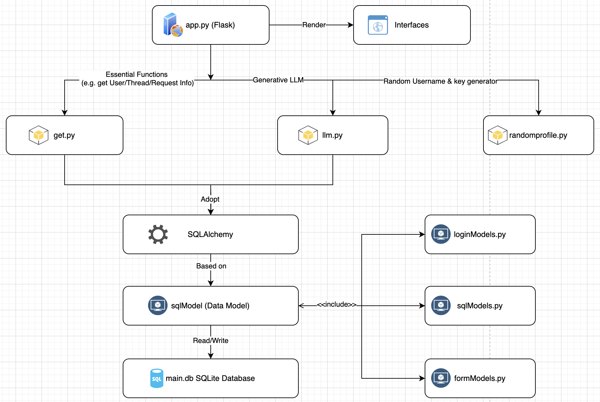

# Assignment 2 Group Project  
  
### Due date: 5 PM on Sunday, May 19th, 2024 (GMT+8)  
  
#### Description  
The Assignment 2 is asked to build a request forum application, which allows users to create accounts, post their own requests and answer other people's requests.  
  
#### Program Structure  
  
This program is based on the following structure:  
- The `app.py` is main application and used for template rendering, content structuring and some data processing  
- This program contains `get.py`. Some functions (e.g. Requrements, Shop, Community and shop) are rely on the functions in `get.py` to get or set the data from the database.  
- The `loginModels.py` is for user login/registration process. When user is authenticated, the user ID will be stored based on this model and available for read during the session till logout.  
- The `sqlModels.py` is used for communication between program and SQLite database. It contains data models, and to help to get/set data from/to database
- The `formModels.py` is for forms on the website. When the webpage loads the form, the forms will be loaded based on this model.  
- This program uses SQLite database (`database/main.db`) to store data  
  
Note: the main database (`database/main.db`) contains some test data. You could use them for program testing.  
  
#### How to get started  
- Clone this project  
- Install dependencies by `pip install -r requirements.txt` (Use `pip install -r requirements.txt --break-system-packages` if you are working on Linux)  
- Use the command `flask run`(Use `flask run --host=0.0.0.0` if debug on productive server) to start the web server  

#### How to do unit test
- Clone this project
- Navigate to the root of the program
- Use command `python -m unittest tests/<filename> -v`

#### Unit Test available
- sql_unittest.py = Unit Test for SQLite
- selenium_test.py = Selenium Unit Test (Chrome Browser is required)

